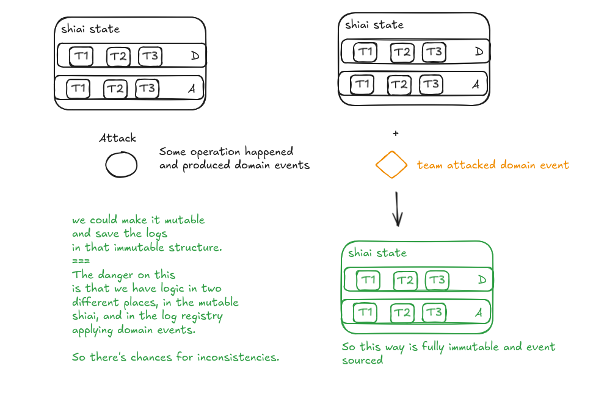

## Random ideas:

1. skill to change attack target
2. skill to change whatever target.
3. skill (passive) to activate more than one skill in the turn.
4. skill (passive) to add a shield directly to prevent status (x amount of times).
5. skill (passive) to bypass shields.

when I say skill -if I don't specify- , it can be active or combo/passive skill.

### 3. 

```rust
pub fn choose_skill(team: Team) -> CardSkill {
 // that should return a list not a single skill.
}
```


## About Shiai State and events



What I don't like is that we have shiai state "open". Normally event
sourced entities still have regular 'command' like methods, and internally
they apply the domain event.

Here we have shiai state quite open, and implementing the "apply domain event"
on each "module".


## Ideas I am undoing

I added a way to change the active skill depending on tier of the card.

I think it's unnecessary, the active skill doesn't need to change, maybe the values
change depending on tier, but that is covered with "valueFormulas(Based on Tier...)".

Maybe it's a way to add more than one skill, but that would be just a different feature
not per tier. And for the passive skills, they belong to a "team" to a set of cards
even if it's just one card, so if I want to change/add the skill depending on tier
that belongs to skill_combo package, on `        cards_team: Vec<Name>,` 
that should take into account the tier too. if I want to do that. 